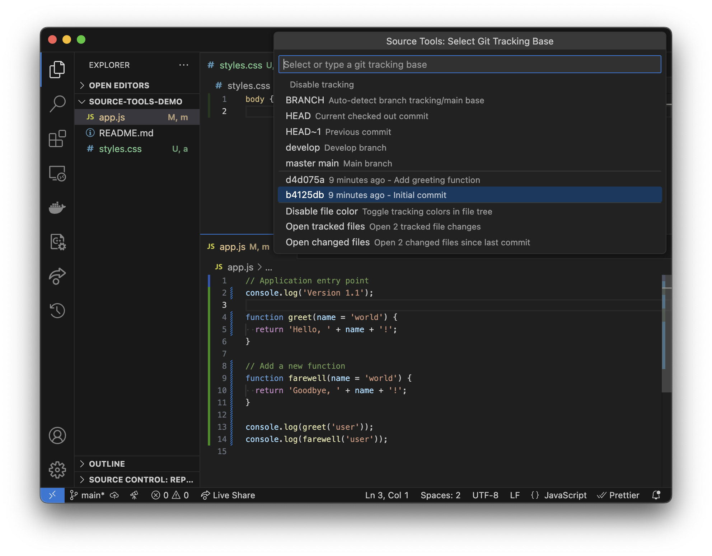

# Source Tools for VS Code

Source Tools enhances your git workflow by providing visual indicators of changes in your code, helping you track modifications since a specific git reference point.

## Features

### 🔄 Git Change Tracking

Source Tools allows you to visually track code changes against **any** git reference (branch, commit, tag) - providing more flexibility than VS Code's built-in git functionality:

- **Line-level indicators** show added, modified, and removed lines
- **File explorer badges** show new and modified files
- **Flexible base ref selection** - track against any branch, commit, or automatic detection
- **Compatible with other git tools** - uses the leftmost gutter, allowing you to see Source Tools and GitHub/GitLens indicators simultaneously

### 📑 Quick File Access

- **Open Tracked Files** - Open all files that have been modified since your tracking base
- **Open Changed Files** - Open all files changed since the last commit

### 🎨 Customization

- Toggle file explorer color highlighting
- Persistent settings across workspace sessions

## Usage

### Setting a Tracking Base

1. Run the command `Source Tools: Git Tracking` from the command palette
2. Select from the quick pick menu:
    - `BRANCH` - Automatically detect the branch tracking base
    - `HEAD` - Track changes since the current commit
    - A recent commit - Select from the list of recent commits
    - Custom reference - Type any valid git reference (branch name, commit hash, etc.)

### Visual Indicators

After setting a tracking base, Source Tools will display:

- **Green indicators** in the gutter for added lines
- **Blue indicators** in the gutter for modified lines
- **Red indicators** in the gutter for removed lines
- **File badges** in the explorer for added/modified files

### Quick Navigation

Access all changed files quickly:

- Run `SourceTools: Open Tracked Files` to open all files modified since your tracking base
- Run `SourceTools: Open Changed Files` to open all files modified since your last commit

## Extension Settings

This extension contributes the following settings:

* `sourceTools.trackingBaseRef`: The git reference to compare against
* `sourceTools.useTreeColor`: Enable/disable colorization in the file explorer

## Requirements

* Git installed and accessible in your PATH
* Files must be within a git repository

## Known Issues

This extension is currently in beta. Please report any issues on the GitHub repository.

## Release Notes

### 0.0.1

* Initial release with git change tracking functionality
* Line-level change indicators
* File explorer badges
* Tracked file navigation

---

**Enjoy source control with enhanced visibility!**
