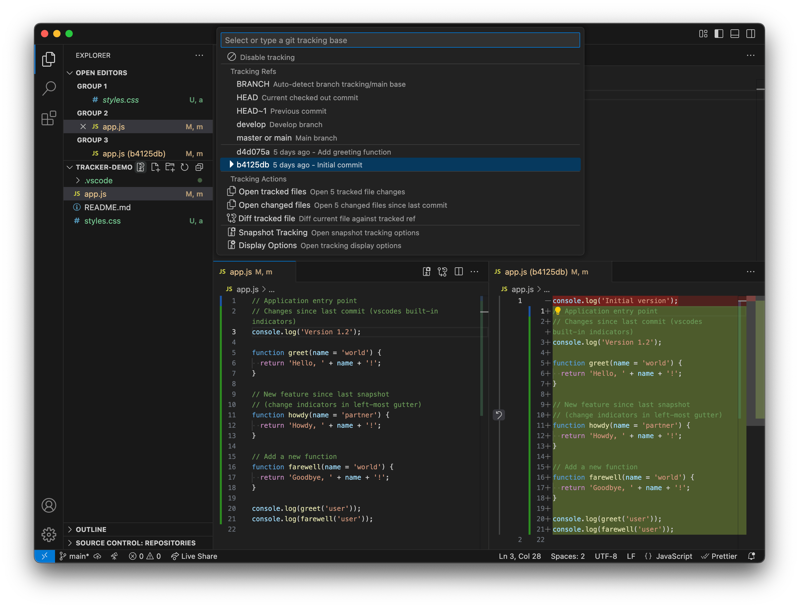
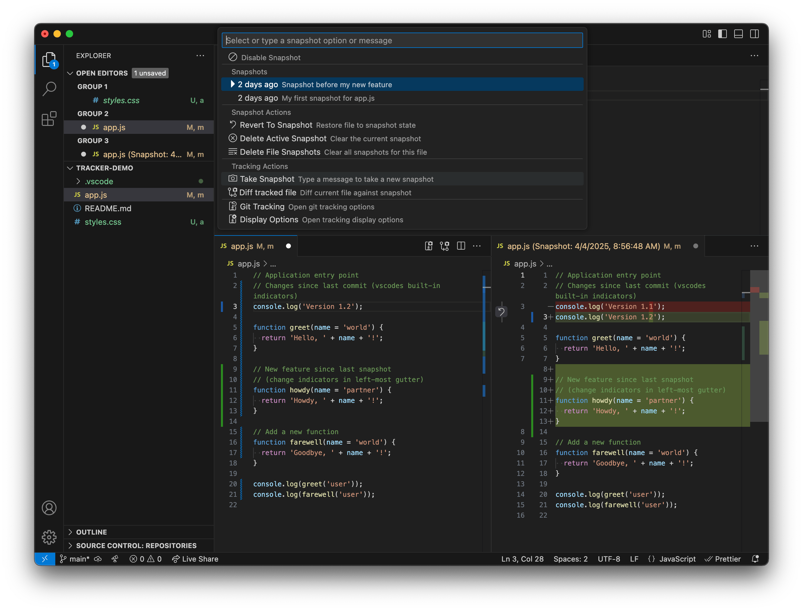

# Source Tracker for VS Code

> **Note:** This extension is currently in early development. It may not perform efficiently with large repositories or large files due to the nature of its diff processing.

Source Tracker enhances your git workflow by providing visual indicators of changes in your code, helping you track modifications since a specific git reference point.

## Features

### 🔄 Git Change Tracking

Source Tracker allows you to visually track code changes against **any** git reference (branch, commit, tag) - providing more flexibility than VS Code's built-in git functionality:

- **Line-level indicators** show added, modified, and removed lines
- **File explorer badges** show new and modified files
- **Flexible base ref selection** - track against any branch, commit, or automatic detection
- **Compatible with other git tools** - uses the leftmost gutter, allowing you to see Source Tracker and GitHub/GitLens indicators simultaneously

### 📸 File Snapshot Tracking

The Snapshot feature lets you take a point-in-time capture of a file:

- **Take Snapshot** - Quickly bookmark a file's state for temporary change tracking
- **Track Against Snapshot** - Visualize and compare changes made since your snapshot
- **Session Persistence** - Snapshots persist across editor sessions
- **Independent of Git** - Works even for unsaved changes or files outside of version control

### 📑 Quick File Access

- **Open Tracked Files** - Open all files that have been modified since your tracking base
- **Open Changed Files** - Open all files changed since the last commit
- **Diff Tracked File** - Open a side-by-side diff view comparing the current file to its state in the tracking base

### 🎨 Customization

- Toggle file explorer color highlighting
- Persistent settings across workspace sessions

## Usage

### Setting a Tracking Base

1. Run the command `SourceTracker: Git Tracking` from the command palette
2. Select from the quick pick menu:
    - `BRANCH` - Automatically detect the branch tracking base
    - `HEAD` - Track changes since the current commit
    - A recent commit - Select from the list of recent commits
    - Custom reference - Type any valid git reference (branch name, commit hash, etc.)

### Visual Indicators

After setting a tracking base, Source Tracker will display:

- **Green indicators** in the gutter for added lines
- **Blue indicators** in the gutter for modified lines
- **Red indicators** in the gutter for removed lines
- **File badges** in the explorer for added/modified files

### Quick Navigation

Access all changed files quickly:

- Run `SourceTracker: Open Tracked Files` to open all files modified since your tracking base
- Run `SourceTracker: Open Changed Files` to open all files modified since your last commit

## Requirements

* Git installed and accessible in your PATH
* Files must be within a git repository

## Known Issues

This extension is currently in beta. Please report any issues on the GitHub repository.

---

**Enjoy source control with enhanced tracking visibility!**
